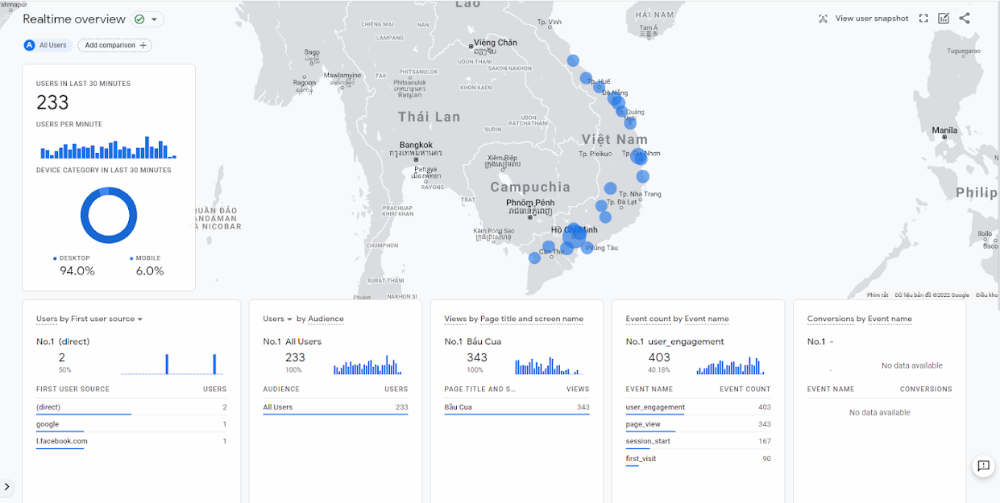

# F-BauCua

This repository is a backend for playing the game **Bầu Cua Tôm Cá** (gourd crab shrimp fish), a Tet event of FPT University with the participation of students from different regions of Vietnam, only play for 2 hours.

Here is the frontend repository link: [GitHub](https://github.com/phuong74200/bau-cua).

## Images

This is a picture of users in real-time and all users accessing the site through Firebase Analytics in production.



This is a live stream image at the university.


## Tech Stack

- NestJS: A progressive Node.js framework to create API
- Class Validator: validate all params, queries, body of the request
- SocketIO: create realtime for clients
- Redis: used for SocketIO can recognize clients when running in different clusters
- Mongoose: used to connect to MongoDB
- PM2: process manager with cluster and remote monitor
- Firebase: used to login and deploy to the frontend

## Features

- Use school email to login via Google
- The game is divided into many rooms, each room will have a certain group of players
- Players will initially be given 200 coins to bet, winning or losing is calculated according to the rules of this game
- After the players finished betting, the admin can roll the dice, then calculate the winnings of the players
- After the end of 1 round, the admin resets the room, the players in the room will be reset to 200 to start playing again

## Installation

Backend requires [Docker](https://www.docker.com/) to run.

- Create the **.env** file with the same format as the **.env.sample** file and config properly. Read more detailed instructions in the file **.env.sample**.
- Copy file serviceAccountKey.json of Firebase to root directory.
- See docs API at endpoint **/docs**

For production environments...

```sh
# Start
docker-compose -f docker-compose.yml -f docker-compose.prod.yml up -d
# Rebuild image Docker and start
docker-compose -f docker-compose.yml -f docker-compose.prod.yml up -d --build
# Shutdown
docker-compose -f docker-compose.yml -f docker-compose.prod.yml down
```

For development environments...

```sh
# Start
docker-compose -f docker-compose.yml -f docker-compose.dev.yml up -d
# Rebuild image Docker and start
docker-compose -f docker-compose.yml -f docker-compose.dev.yml up -d --build
# Shutdown
docker-compose -f docker-compose.yml -f docker-compose.dev.yml down
```
